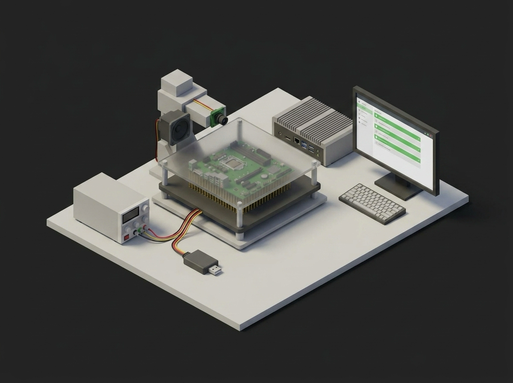

# PCBA Functional Test



A TofuPilot Framework procedure for a pogo-pin functional test station: checks the fixture before power, soft-starts the board and captures inrush, verifies rails and ripple, enters the firmware test mode over UART, runs GPIO loopback and an ADC linearity sweep in parallel with the operator's visual checks, measures stop-mode current, and always powers the fixture down in teardown.

## What This Shows

| Feature | Where |
|---------|-------|
| Setup stage gating power | `setup:` -- `phases/fixture_check.py` |
| Run metadata (fixture id, cycle count, line) | `phases/fixture_check.py` -- `run.metadata[...]` |
| DAG with fan-out and fan-in | `procedure.yaml` -- three phases depend on `dut_handshake`, `sleep_current` depends on all three |
| Multi-dimensional measurements with custom aggregations | `inrush` (`peak_ma`, `steady_ma`), `adc_sweep` (`gain_error_pct`, `offset_mv`, `r2`) |
| Progress components updated from Python | `phases/gpio_loopback.py`, `phases/analog_linearity.py` -- `ui.<key> = ...` |
| Operator switches bound to boolean measurements | `procedure.yaml` -- `operator_checks` UI, `--ui-values ui.json` for unattended runs |
| JSON measurement validated against an empty list | `gpio_failed_channels == []` |
| Unit metadata written from Python | `phases/dut_handshake.py` |
| Teardown stage | `teardown:` -- `phases/power_down.py` |

## Get Started

1. Sign up for a free TofuPilot account at [tofupilot.app](https://www.tofupilot.app/auth/signup).
2. Open the **New Procedure** flow in the dashboard and clone this template.
3. Follow the dashboard's instructions to set up a station and run the procedure.

For deeper guides, see the [TofuPilot docs](https://www.tofupilot.com/docs/framework) and the [Functional Test Fixture template page](https://www.tofupilot.com/templates/functional-test-fixture-fct).

## Structure

```
.
├── procedure.yaml                    # Procedure, plugs, phases, measurements
├── ui.json                           # Pre-baked operator answers for unattended runs
├── phases/
│   ├── fixture_check.py              # Setup: interlock, vacuum, run metadata
│   ├── power_on.py                   # Soft-start ramp, inrush capture, rails
│   ├── dut_handshake.py              # Test mode, firmware and hardware revision
│   ├── gpio_loopback.py              # 32-channel loopback with progress
│   ├── analog_linearity.py           # ADC sweep, gain/offset/R² aggregations
│   ├── operator_checks.py            # LED photodiodes next to the operator switches
│   ├── sleep_current.py              # Stop-mode current
│   └── power_down.py                 # Teardown: Vin off
├── plugs/
│   ├── psu.py                        # Mock fixture supply with inrush capture
│   ├── daq.py                        # Mock fixture DAQ (rails, DIO, AWG, photodiodes)
│   └── dut.py                        # Mock DUT firmware test mode over UART
├── utils/
│   └── linearity.py                  # Least-squares gain, offset, R²
├── pyproject.toml                    # uv-managed Python project
└── README.md
```

## Replace the Mocks with Real Hardware

`plugs/psu.py` maps to a pyvisa supply with a current capture (or a scope on a shunt), `plugs/daq.py` to nidaqmx or a USB DAQ, `plugs/dut.py` to pyserial against the firmware test-mode protocol. The phases, measurements and limits stay the same.
